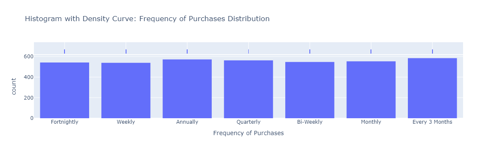

# Análise de Preferências de Compras no Shopping: Insights Estratégicos para Aumento de Lucros

Esta análise visa extrair insights valiosos sobre a preferência das pessoas durante as compras com base em alguns dados históricos que serão cruciais para orientar o planejamento estratégico do shopping, permitindo ajustes precisos na oferta de produtos e serviços para maximizar a satisfação do cliente e, consequentemente, aumentar a rentabilidade.

# Descrição do Dataset:

Conjunto de dados: [disponível no Kaggle](https://www.kaggle.com/datasets/iamsouravbanerjee/customer-shopping-trends-dataset)

Glossário do conjunto de dados:

* `Customer ID` -  Identificador único para cada cliente.
* `Age` - Idade do cliente.
* `Gender` - Sexo do cliente (Masculino/Feminino).
* `Item Purchased` - O item comprado pelo cliente.
* `Category`- Categoria do item comprado.
* `Purchase Amount (USD`- O valor da compra em USD.
* `Location`- Localização onde a compra foi efectuada.
* `Size`- Tamanho do item comprado.
* `Color`- Cor do item comprado.
* `Season`- Estação durante a qual a compra foi efectuada.
* `Review Rating`- Classificação dada pelo cliente para o item comprado.
* `Subscription Status`- Indica se o cliente tem uma subscrição (Sim/Não).
* `Shipping Type`- Tipo de envio escolhido pelo cliente.
* `Discount Applied`- Indica se foi aplicado um desconto à compra (Sim/Não).
* `Promo Code Used` - indica se foi utilizado um código promocional para a compra (Sim/Não).
* `Previous Purchases`- O número total de transacções concluídas pelo cliente na loja, excluindo a transação em curso.
* `Payment Method`- O método de pagamento preferido do cliente.
* `Frequency of Purchases`- Frequência com que o cliente efectua compras (por exemplo, semanal, quinzenal, mensal).

# Etapas do Projeto:

* **Conhecendo o Dataset**: Importação das bibliotecas necessárias e leitura do conjunto de dados.
* **Análises Preliminares**: Exploração inicial dos dados, com o objetivo de responder perguntas e obter insights importantes.
* **Visualização dos Dados**: Utilização de gráficos de boxplot e histograma para entender a distribuição dos dados e identificar possíveis outliers. Também plotagem de gráficos de dispersão para observar as relações entre as variáveis.

# Análise Exploratória dos Dados

### 1. Distribuição de Idade

- A maioria das pessoas que fazem compras pertence a faixa etária 20-60.

---

### 2. Distribuição por Gênero

- O maior número de compras é realizado por homens.

---

### 3. Itens mais comprados

- Blusa é o item mais comprado, seguido de Jóias e Calças.

---

### 4. Compras por Estação

- As pessoas fazem as suas compras sobretudo na primavera e no outono.

---

### 5. Distribuição por Localização

- A maioria das pessoas prefere fazer compras no ponto de venda "Montana", seguido do ponto de venda "Califórnia.

### 6. Método de Pagamento Preferido

- "PayPal" é o método mais preferido, seguido de "cartão de crédito" e "dinheiro".

---

### 7. Distribuição da Frequência de Compras

- A maioria das pessoas prefere fazer compras de "A cada 3 meses', seguido de "Anualmente".

---

### 8. Uso de cupom de desconto

- A maioria das pessoas faz compras sem utilizar cupom de desconto.

---

### 9. Tipo de Envio Preferido

- A maioria das pessoas opta por "Envio gratuito", seguido de "Padrão" e "Retirar na loja".

---

### 10. Média de avaliações por gênero

- A média de avaliações dos homens é maior que a média de avaliações das mulheres.

---

### 11. Preferência de Cor

- A maioria das pessoas compra roupa de cor "Oliva", seguida de "Amarelo" e "Prateado".

---

### 12. Categoria por Gênero e Método de Pagamento

- A maioria das compras é feita por homens.
- A maioria dos homens compra roupa e acessórios.
- A maioria efectua o pagamento com cartão de crédito.

